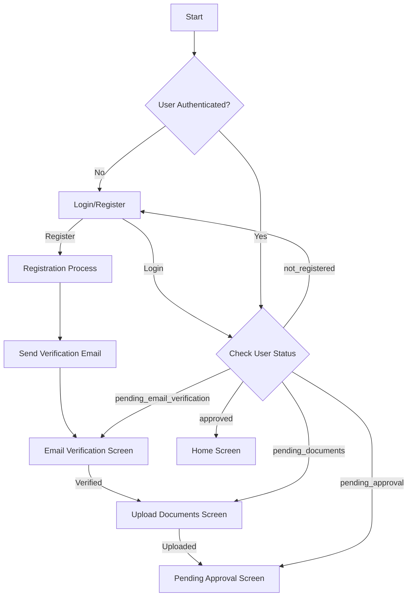

# Corrected Authentication Flow Technical Specification

This document provides a refined technical specification for the authentication system, addressing the discrepancies identified between the `new_auth_flow_design.md` and the current implementation.

## 1. User Authentication and Onboarding Flow

The following steps outline the complete user journey from registration to becoming an active user:

1.  **Registration:** The user fills out the registration form and submits their credentials.
2.  **Email Verification:** An email is sent to the user's registered address with a verification link.
3.  **Document Upload:** Once the email is verified, the user is prompted to upload the required documents.
4.  **Pending Approval:** After submitting the documents, the user's account is marked as pending approval.
5.  **Admin Review:** An administrator reviews the submitted documents and approves or rejects the application.
6.  **Active User:** Upon approval, the user can log in and access the application's features.

## 2. `AuthService` Logic

The `AuthService` will be the single source of truth for all authentication-related operations. The following logic must be implemented:

-   **`registerWithEmailAndPassword`:**
    -   Create a new user with the provided email and password.
    -   Set the initial user status to `pending_email_verification`.
    -   Set `isEmailVerified` to `false`.
    -   Send a verification email to the user.
-   **`signInWithEmailAndPassword`:**
    -   Authenticate the user with the provided credentials.
    -   Fetch the user's data from Firestore.
    -   Return a `UserModel` object with the user's current status.
-   **`uploadDocument`:**
    -   Upload the user's documents to Firebase Storage.
    -   Update the user's status to `pending_approval`.
    -   Set `hasUploadedDocuments` to `true`.

## 3. Corrected Navigation Map

The navigation flow will be strictly enforced based on the user's status. The following diagram illustrates the correct navigation map:

## 4. `UserModel` Adjustments

The `UserModel` is already aligned with the design and does not require any further adjustments. The `status` field will be used to control the user's access and navigation within the application.