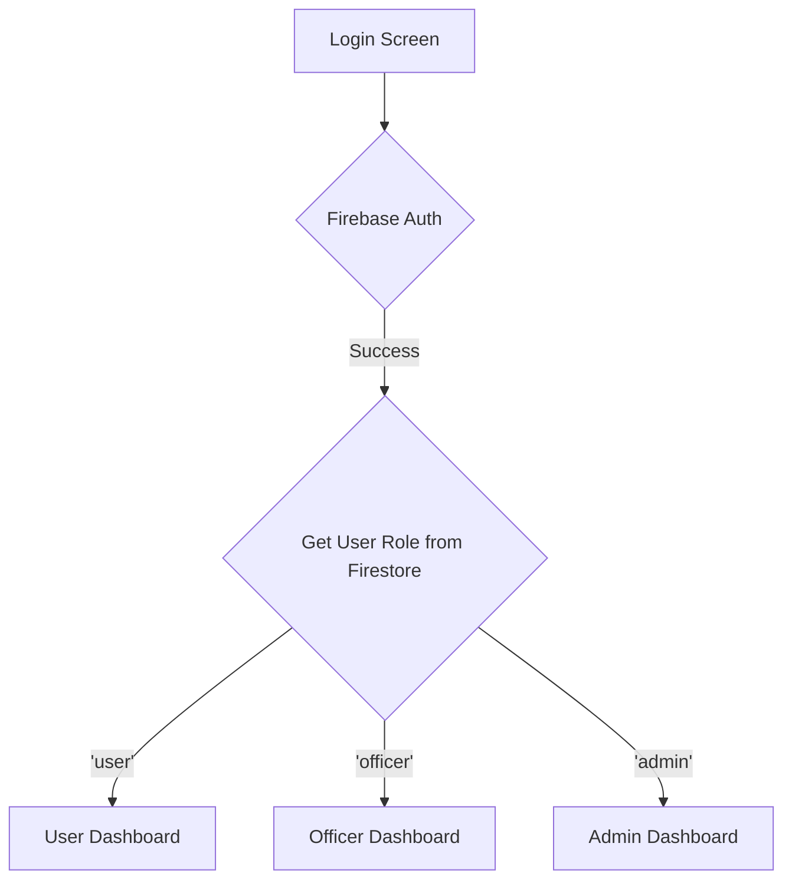

# Authentication and Registration Flow Design

This document outlines the design for the authentication and registration flow of the Flutter application, incorporating user roles, document uploads, and secure, cloud-side role checking.

## 1. User Roles

The application will have the following user roles:

| Role | Permissions |
| :--- | :--- |
| **user** | - Can register and create an account.<br>- Can submit clearance applications.<br>- Can view the status of their applications.<br>- Can upload and manage their own documents.<br>- Can edit their own profile. |
| **officer** | - All permissions of a 'user'.<br>- Can view and verify user registrations.<br>- Can approve or reject clearance applications.<br>- Can view user-uploaded documents for verification.<br>- Can access a dashboard with relevant statistics and reports. |
| **admin** | - All permissions of an 'officer'.<br>- Can manage user accounts (e.g., assign roles, suspend users).<br>- Can access and manage all data in the system.<br>- Can configure application settings.<br>- Can view audit logs. |


## 2. Registration Flow

The registration process will be as follows:

1.  **Account Creation:** The user creates an account using their email and password.
2.  **Profile Information:** The user provides their personal information (e.g., full name, date of birth, nationality).
3.  **Document Submission:** The user uploads the required documents for verification.
4.  **Pending Approval:** After submitting their information and documents, the user is shown a "pending approval" screen.
5.  **Admin Verification:** An 'officer' or 'admin' reviews the registration and documents.
6.  **Account Activation:** Upon approval, the user's account is activated, and they are notified.

### Firestore Data Model

A `users` collection will be created in Firestore to store user data. Each document in this collection will have the user's UID from Firebase Authentication as its ID.

**User Document Structure:**

```json
{
  "uid": "Firebase UID",
  "email": "user@example.com",
  "fullName": "John Doe",
  "dateOfBirth": "YYYY-MM-DD",
  "nationality": "Country",
  "role": "user", // Default role
  "status": "pending", // or "approved", "rejected"
  "createdAt": "Timestamp",
  "updatedAt": "Timestamp",
  "documents": [
    {
      "documentName": "Passport",
      "storagePath": "/users/{uid}/documents/passport.pdf",
      "uploadedAt": "Timestamp"
    }
  ]
}
```


## 3. Document Upload

The document upload process will be handled as follows:

1.  **File Selection:** The user selects the document to upload from their device.
2.  **Upload to Firebase Storage:** The file is uploaded to a dedicated folder in Firebase Storage. The folder structure will be `users/{uid}/documents/`, where `{uid}` is the user's Firebase UID.
3.  **Store Reference in Firestore:** Once the upload is complete, a reference to the file in Firebase Storage is stored in the user's Firestore document, as detailed in the data model above.
4.  **Secure Access:** Firebase Storage security rules will be configured to ensure that only authenticated users can upload documents and that users can only access their own documents. Admins and officers will have broader access privileges to view documents for verification.


## 4. Login Flow

1.  **Credentials Entry:** The user enters their email and password on the login screen.
2.  **Authentication with Firebase:** The application uses Firebase Authentication to verify the credentials.
3.  **Retrieve User Data:** Upon successful authentication, the application retrieves the user's data from the `users` collection in Firestore using the UID provided by Firebase Authentication.
4.  **Role-Based Redirection:** The application checks the `role` field in the user's Firestore document and redirects them to the appropriate home screen.

## 5. Role-Based UI

The UI will adapt based on the user's role to ensure that users only see the features and data relevant to them.

-   **User:** After logging in, a 'user' will be directed to a dashboard where they can submit new clearance applications and view the status of their existing applications.
-   **Officer:** An 'officer' will be directed to a dashboard that displays pending registration approvals and clearance applications. They will have access to a user management interface to view and verify user details.
-   **Admin:** An 'admin' will have access to all the features of an 'officer', plus additional administrative functionalities such as user role management, application settings, and audit logs.

A `Mermaid` diagram illustrating the role-based UI flow:




## 6. Cloud-Side Role Checking

To ensure that users can only access data and perform actions appropriate for their role, role checks will be implemented within Firebase Cloud Functions.

1.  **Custom Claims:** When an admin assigns a role to a user, a Cloud Function will be triggered to set a [custom claim](https://firebase.google.com/docs/auth/admin/custom-claims) on the user's Firebase Authentication token. This will embed the user's role directly into their ID token.
2.  **Secure Backend Operations:** For any backend operation that requires specific permissions (e.g., approving a registration, accessing sensitive data), a Cloud Function will be used.
3.  **Token Verification:** Inside the Cloud Function, the user's ID token will be verified. The function will check the `role` from the custom claims and only allow the operation to proceed if the user has the required permissions.
4.  **Firestore Security Rules:** While Cloud Functions provide a robust way to secure backend operations, [Firestore Security Rules](https://firebase.google.com/docs/firestore/security/get-started) will also be used to control direct access to data from the client-side. The rules will be configured to check the user's role from their ID token's custom claims.

This approach ensures that even if the client-side code is compromised, unauthorized access to data and operations will be prevented at the backend.
